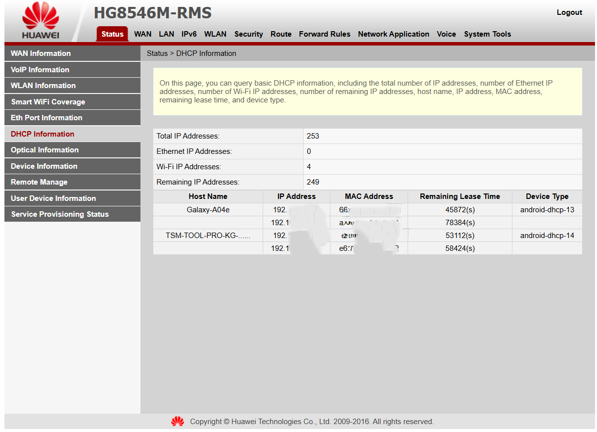
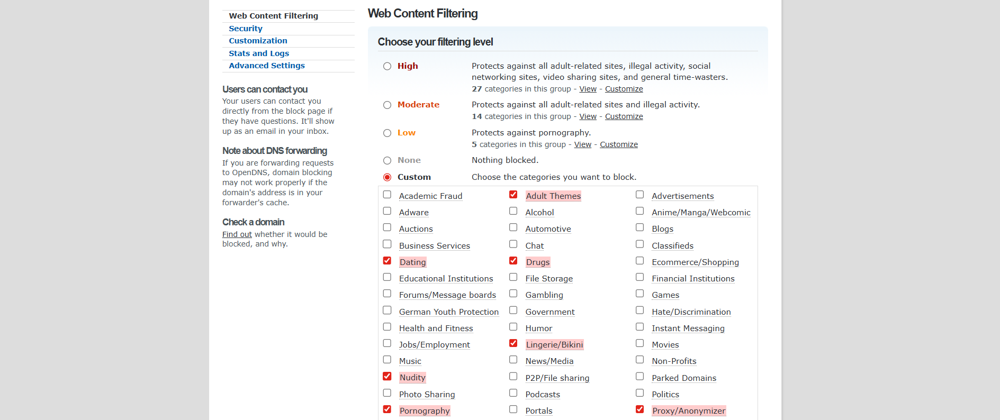
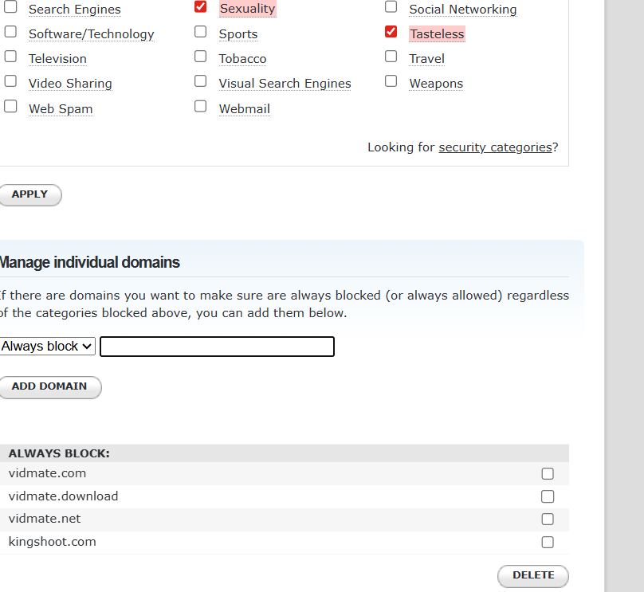
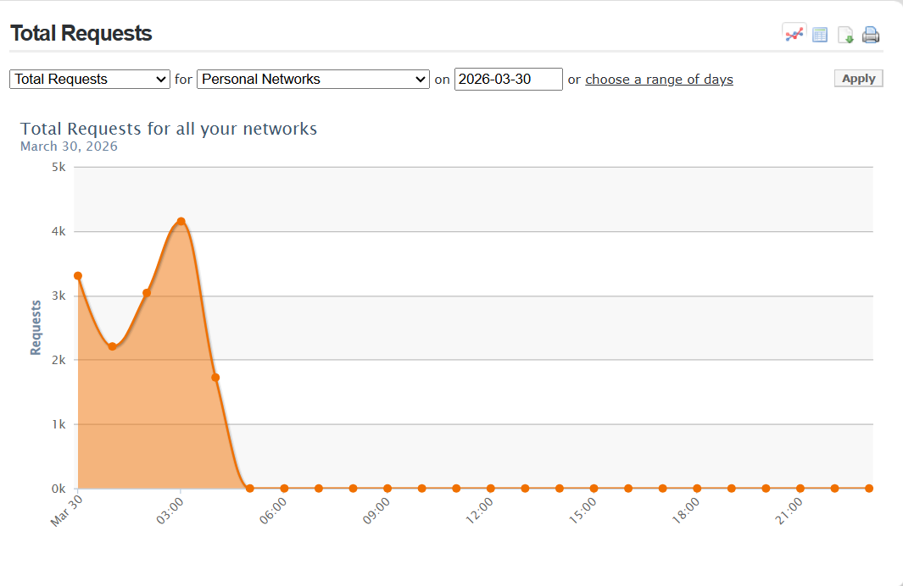
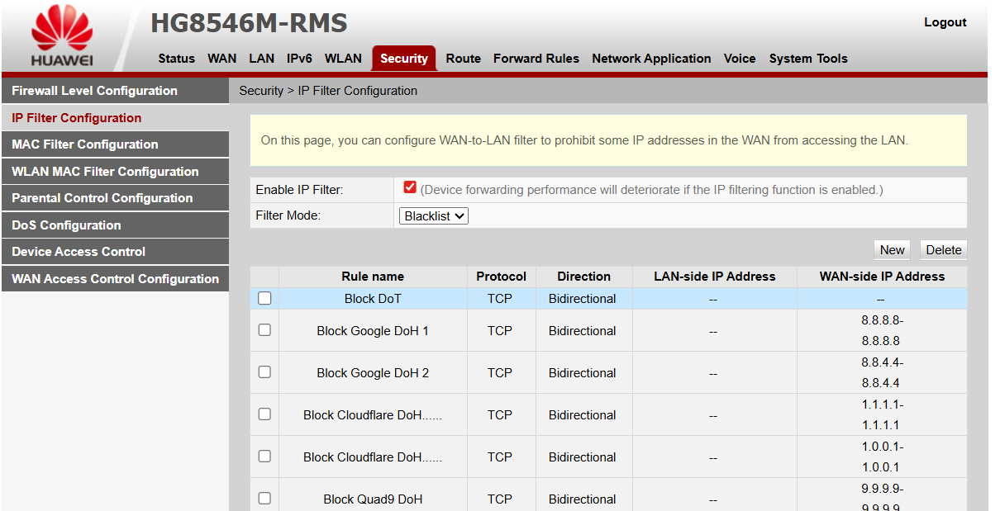
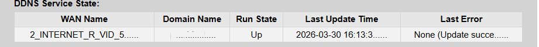

# Full Setup Guide

> This is the complete technical walkthrough. If you landed here directly,
> start with the [README](README.md) for context on why this guide exists.

---

## Table of Contents

- [01: Identify All Devices on Your Network](#01.identify-all-devices-on-your-network)
- [02: Set Up OpenDNS Home](#02.set-up-opendns-home)
- [03: Configure Your Router DNS](#step-3--configure-your-router-dns)
- [04: Block DNS Bypass Methods](#step-4--block-dns-bypass-methods)
- [05: Set Up DDNS for IP Auto-Update](#step-5--set-up-ddns-for-ip-auto-update)
- [06: Block Sideloaded App Download Sites](#step-6--block-sideloaded-app-download-sites)
- [07: Set Time-Based Restrictions Per Device](#step-7--set-time-based-restrictions-per-device)
- [Monitoring and Maintenance](#monitoring--maintenance)
- [Common Bypass Attempts and Countermeasures](#common-bypass-attempts--countermeasures)
- [Limitations](#limitations)

---

## 01. Identify All Devices on Your Network

### 1.1 Access the DHCP Client List

Log into your router admin panel (usually `http://192.168.100.1` or `http://192.168.1.1`).

Navigate to: **Status → DHCP Information**

This page lists every connected device with:
- Hostname
- IP Address
- MAC Address (unique hardware identifier)
- Device type
- 

  
### 1.2 Build Your Device Registry

Write down the MAC address of every device and assign it to a person. This is your audit trail.
A simple table is sufficient — Owner, Device, IP, MAC Address, Notes.

> **Note on Randomised MACs:** Modern Android devices use MAC randomisation by default.
> MACs where the second hex character is `2`, `6`, `A`, or `E` are randomised private addresses.
> To disable this per network on each Android device:
> **Settings → WiFi → long-press your network → Privacy → Use device MAC**
>
> Without doing this, a device can reconnect with a different MAC address and bypass any
> MAC-based rules you have set.

### 1.3 Analyse Connection Logs

Export WiFi event logs from **System Tools → Log** (location varies by firmware).

Red flags to look for:
- Devices connecting during late night or early morning hours
- Devices with no hostname (unnamed / unregistered)
- Frequent short connect/disconnect cycles on the same MAC address

> **Example:** A device that connects at 1:52am, disconnects at 1:52:28am, reconnects at
> 4:37am with no registered hostname is a device worth identifying before applying controls.

---

## 02. Set Up OpenDNS Home

### 2.1 Create Your Account

1. Go to [opendns.com/home-internet-security](https://www.opendns.com/home-internet-security/)
2. Sign up for a free Home account
3. After login, go to **Settings → Add a network**
4. OpenDNS will auto-detect your public IP — click **"Add this network"** and name it

### 2.2 Configure Content Filtering

In your OpenDNS dashboard: **Settings → [Your Network] → Web Content Filtering → Custom**

Recommended categories to block:

| Category | Reason |
|---|---|
| Pornography | Core adult content |
| Adult Themes | Broader adult material |
| Nudity | Image and video content |
| Sexuality | Sexual content |
| Lingerie/Bikini | Borderline / gateway content |
| Tasteless | Shock content, gore |
| Proxy/Anonymizer | Blocks VPN and web proxy bypass attempts |
| P2P/File Sharing | Blocks torrent and piracy sites |

> **Note on Proxy/Anonymizer:** If you use a personal VPN for work or privacy, leaving this
> unticked avoids blocking your own usage. Be aware it leaves a bypass avenue open.
> A practical workaround: tick it and use your VPN on mobile data rather than home WiFi.



### 2.3 Enable Security Categories

Scroll to the bottom of the content filtering page and click **"Looking for security categories?"**

Enable:
- ✅ Botnet
- ✅ Phishing
- ✅ Malware

  

These protect every device from malicious sites beyond content filtering.

### 2.4 Enable Stats and Logs

Go to **Settings → Stats and Logs → Enable stats and logs** → Apply.

This activates your activity dashboard — DNS queries, top domains, blocked attempts,
and request volume over time.



---

## 03. Configure Your Router DNS

DNS settings must be applied in **two places** on your router. Both are required.

### 3.1 LAN/DHCP DNS — Pushes OpenDNS to All Devices

Navigate to: **LAN → DHCP Server Configuration**

Set:
- **Primary DNS Server:** `208.67.222.222`
- **Secondary DNS Server:** `208.67.220.220`

Click Apply.

### 3.2 WAN DNS Override — Router Itself Uses OpenDNS

Navigate to: **WAN → WAN Configuration → click your active internet connection**

1. Tick **"Enable DNS Override"**
2. Set:
   - **Primary DNS Server:** `208.67.222.222`
   - **Secondary DNS Server:** `208.67.220.220`
3. Ensure your **WiFi SSIDs are ticked** under Binding Options — if SSIDs are not bound,
   WiFi devices may not route through this connection at all
4. Click Apply

> **Why both?** LAN/DHCP pushes DNS server addresses to every connected device.
> WAN Override ensures the router itself uses OpenDNS instead of your ISP's default DNS.
> Without the WAN setting, the router may bypass OpenDNS for its own lookups.

---

## 04. Block DNS Bypass Methods

This step is what separates a basic setup from a robust one.

Modern apps — including VidMate, Snaptube, and many popular browsers — can silently bypass
your router's DNS using:

- **DNS-over-TLS (DoT):** Encrypted DNS queries sent directly to external servers on port 853
- **DNS-over-HTTPS (DoH):** DNS tunnelled through HTTPS on port 443, using hardcoded server IPs

Standard DNS filtering does not intercept these. They must be blocked at the firewall.



### 4.1 Navigate to IP Filter

Go to: **Security → IP Filter Configuration**

- Tick **Enable IP Filter**
- Set Filter Mode to **Blacklist**

### 4.2 Add Firewall Rules

Click **New** for each rule. Leave all LAN-side IP fields blank (rules apply to all devices).

#### Rule 1 — Block DNS-over-TLS (port 853)

| Field | Value |
|---|---|
| Rule name | `Block DoT` |
| Protocol | TCP |
| WAN-side TCP Port | `853` |

#### Rules 2–6 — Block DoH Server IPs

For each rule: Protocol = `TCP`, WAN-side TCP Port = `443`

| Rule name | WAN-side IP |
|---|---|
| `Block Google DoH 1` | `8.8.8.8` |
| `Block Google DoH 2` | `8.8.4.4` |
| `Block Cloudflare DoH 1` | `1.1.1.1` |
| `Block Cloudflare DoH 2` | `1.0.0.1` |
| `Block Quad9 DoH` | `9.9.9.9` |

> ⚠️ **Do NOT add port 53 block rules.** Blocking all outbound port 53 traffic will break
> your entire internet connection — including the router's own DNS queries to OpenDNS.
> The rules above are targeted and will not affect normal browsing or streaming.

---

## Step 5 — Set Up DDNS for IP Auto-Update

OpenDNS Home applies filtering based on your registered public IP address. Most home ISPs
use dynamic IPs that can change without notice — silently breaking your filtering when they do.

DDNS keeps OpenDNS updated automatically whenever your IP changes.

Navigate to: **Network Application → DDNS Configuration → New**

| Field | Value |
|---|---|
| Enable DDNS | ✅ Ticked |
| WAN Name | Your active internet WAN connection |
| Domain Name | Your OpenDNS network label (e.g. `mashhome`) |
| Service Provider | `dyndns` |
| Host of the service provider | `updates.opendns.com` |
| Service Port | `80` |
| User Name | Your OpenDNS account email |
| Password | Your OpenDNS account password |

Click Apply. The **DDNS Service State** table should show **Run State: Up** within a minute.

> **If you get "Service not available" on port 443**, switch to port `80`.
> This is a known compatibility issue on PPPoE-based ISP configurations.
>
> OpenDNS is not natively listed as a DDNS provider on most routers. Use `dyndns` as the
> service provider — OpenDNS supports the DynDNS update protocol via `updates.opendns.com`.

  

---

## Step 6 — Block Sideloaded App Download Sites

Apps like VidMate are distributed as APK files outside official app stores.
Once installed they cannot be removed by Play Protect alone. Block their sources at the router.

Navigate to: **Security → Parental Control Configuration**
(or **URL Filter** / **Domain Filter** depending on your router firmware)

Add these domains to the block list (feel free to add more if you know them ):

```
vidmate.net
vidmateapp.com
vidmate.download
snaptube.com
tubemate.net
9apps.com
apkpure.com
apkmirror.com
happymod.com
```

These are the primary distribution points for sideloaded APKs known to bypass content controls
or bundle adware and spyware.

---

## 07. Set Time-Based Restrictions Per Device

Navigate to: **Security → Parental Control Configuration**

For each device you want to restrict:
1. Add the device by its **MAC address** (from your device registry in Step 1)
2. Set permitted internet hours (e.g. `06:00–22:00`)
3. Click Apply

Devices outside permitted hours are blocked from the internet entirely.
Local network resources remain available. Different schedules can be set per device.

---

## Monitoring & Maintenance

### Checking OpenDNS Activity

Log into your OpenDNS dashboard and review:
- **Stats → Total Requests** — overall DNS query volume
- **Stats → Blocked Domains** — what is being blocked and how often
- **Stats → Top Domains** — the most visited domains on your network

A spike in blocked requests or an unfamiliar domain appearing frequently is worth investigating.

### Checking the Router Device List

Periodically review **Status → DHCP Information** for:
- Unknown or unnamed devices
- New MAC addresses you do not recognise
- Devices connected at unexpected hours

### When Filtering Stops Working

1. Check your current public IP at [whatismyip.com](https://www.whatismyip.com)
2. Compare it to the IP shown in your OpenDNS dashboard
3. If they differ, go to **Network Application → DDNS Configuration** and check Run State
4. If DDNS is Down, toggle Enable DDNS off and back on, then Apply
5. As a fallback, manually update your IP: **OpenDNS Dashboard → Settings → Your Network → Update IP**

---

## Common Bypass Attempts & Countermeasures

| Bypass method | Countermeasure in this guide |
|---|---|
| App uses Google DNS (8.8.8.8) directly | Blocked by DoH IP firewall rules |
| DNS-over-TLS on port 853 | Blocked by port 853 firewall rule |
| DNS-over-HTTPS via Cloudflare or Google | Blocked by IP firewall rules |
| Downloading VidMate or similar APKs | Domain block list in Step 6 |
| Web proxy or free VPN app | Blocked if Proxy/Anonymizer category is enabled |
| Switching to mobile data (4G/5G) | Out of scope — requires carrier-level controls |

---

## Limitations

- **Mobile data bypasses everything here.** Router controls only apply to WiFi traffic.
- **Advanced VPNs with non-standard server IPs** may still work if those IPs are not blocked.
- **HTTPS content inspection** requires more advanced hardware (pfSense, OPNsense).
- **Physical access cannot be controlled here.** A device used elsewhere is out of scope.

This guide is a strong defensive layer. It works best alongside open conversations with
your children about internet safety — not instead of them.

---

## References

- [OpenDNS Home](https://www.opendns.com/home-internet-security/)
- [OpenDNS Support — Dynamic IP Update](https://support.opendns.com/hc/en-us/articles/227987627)
- [Upstream Security — VidMate Research](https://www.upstream.ag)
- [Internet Watch Foundation](https://www.iwf.org.uk)

---

*Back to [README](README.md)*
